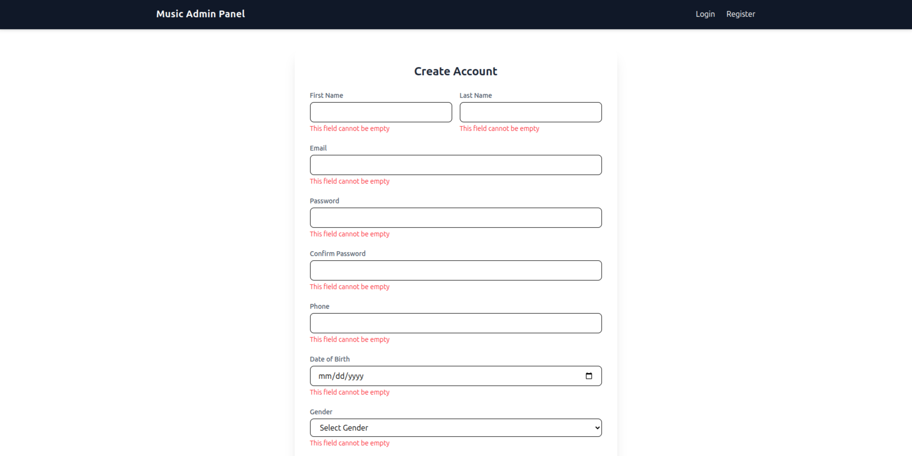
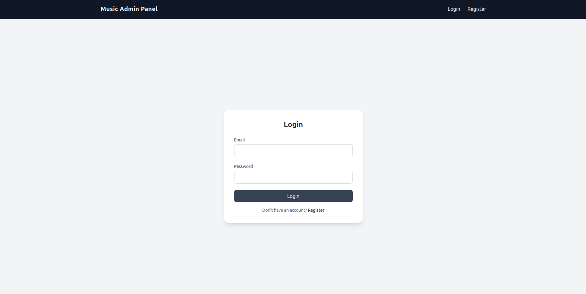
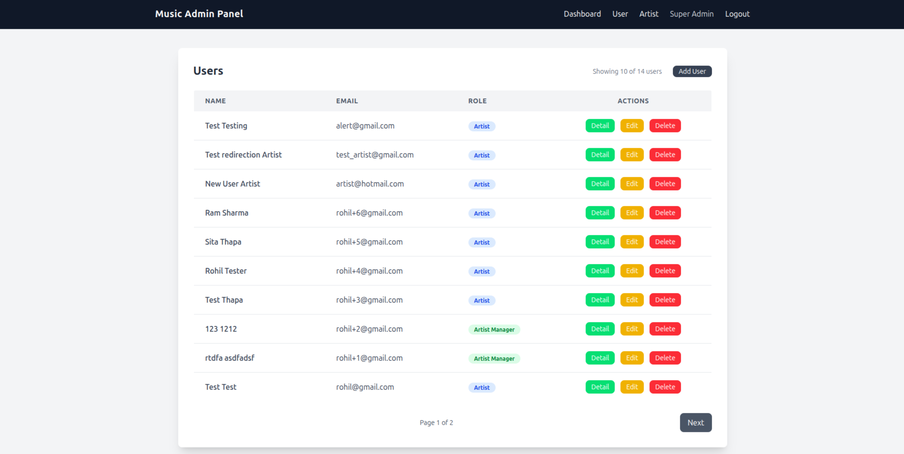
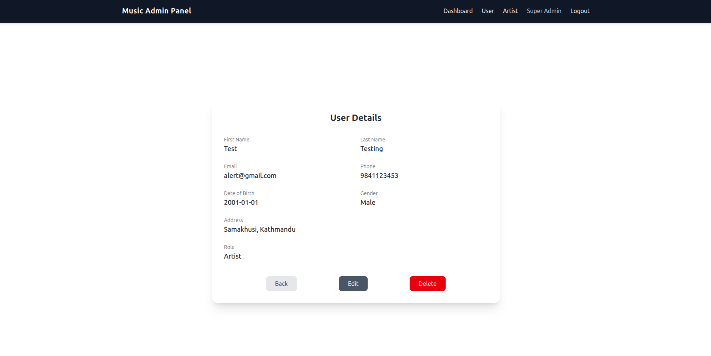
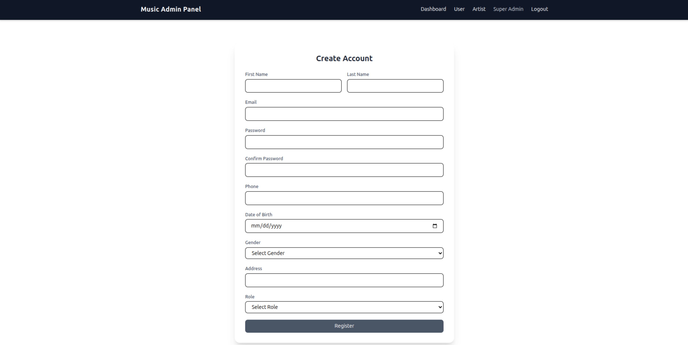
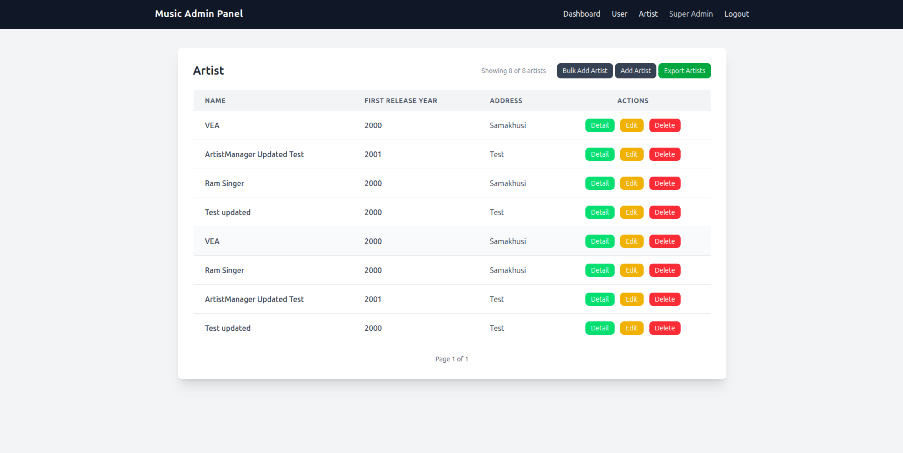
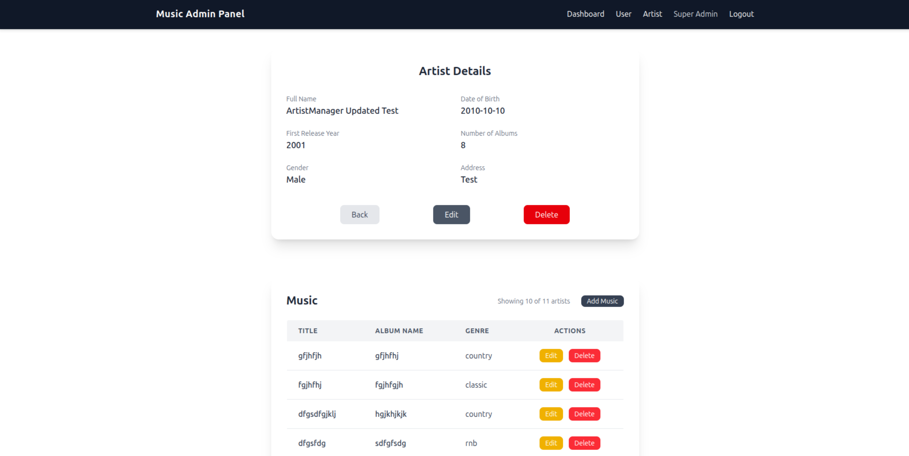

# Simple RBAC CRUD App using Flask with session based authentication

## TODOs Security & Testing Enhancements (Pending)

- **Security**
    - Add CSRF token to forms and verify to protect against CSRF attacks.
- **Testing**
    - Implement test cases for authentication, route permissions, and CRUD operations.


### Setup Process

- sync dependency
```bash
uv sync
```

- create .env file using example.env

- setup db: this command will create tables for application
```bash
uv run python -m app.setup_db
```

- create super-admin: this command will create super-admin user
```bash
uv run flask create-super-admin
```

- to run project
```bash
uv run flask --app app run --debug
```

### Setup Run using Docker

- create .docker.env file with the help of example.env

- build the project
```bash
docker compose build --no-cache
```
- run the project
```bash
docker compose up    
```

### Note: Default email and password for docker app is:

email: ```admin@admin.com```

password: ```admin123```


### Project Structure

```bash
app/
├── routes/                     # include all the route for the folder
│   ├── __init__.py
│   ├── artist.py
│   ├── auth.py
│   ├── dashboard.py
│   ├── music.py
│   └── user.py
├── services/                   # include validation for tables     
│   ├── __init__.py
│   ├── artist.py
│   ├── auth.py
│   └── music.py
├── static/                     # include static file like js and css
│   ├── main.js
│   └── style.css
├── templates/                  # include jinja template
│   ├── artist/
│   ├── auth/
│   ├── components/
│   ├── music/
│   ├── user/
│   ├── 404.j2
│   ├── base.j2
│   └── dashboard.j2
└── utils/                      # include project utils for auth and Validator class
│   ├──
│   ├── decorators.py
│   ├── exceptions.py
│   └── validator.py
├── __init__.py
├── config.py
├── db.py
├── models.py
└── setup_db.py
.env                            # copy example.env and update with own data
.gitignore
.python-version
example.env
pyproject.toml                  # install dependecy using uv
requirements.txt                # install dependency using pip
```


## ScreenShot

- Registration form with validation error

- login form

- User list

- User Detail

- User add form

- Artist list

- Artist detail
